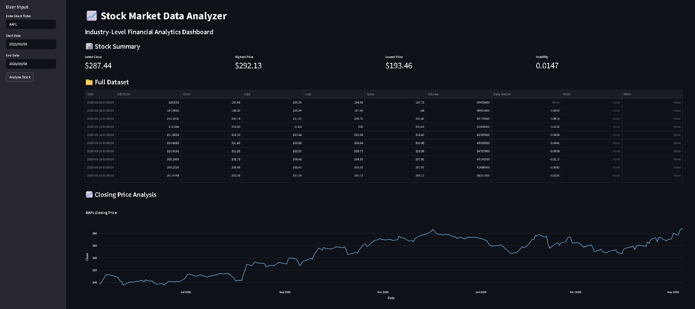
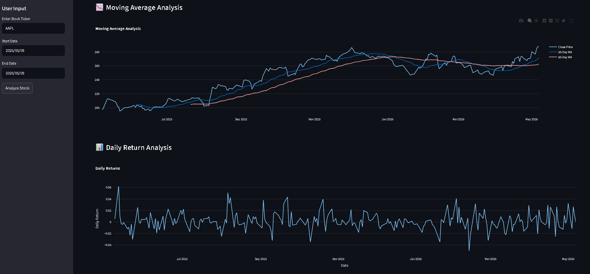
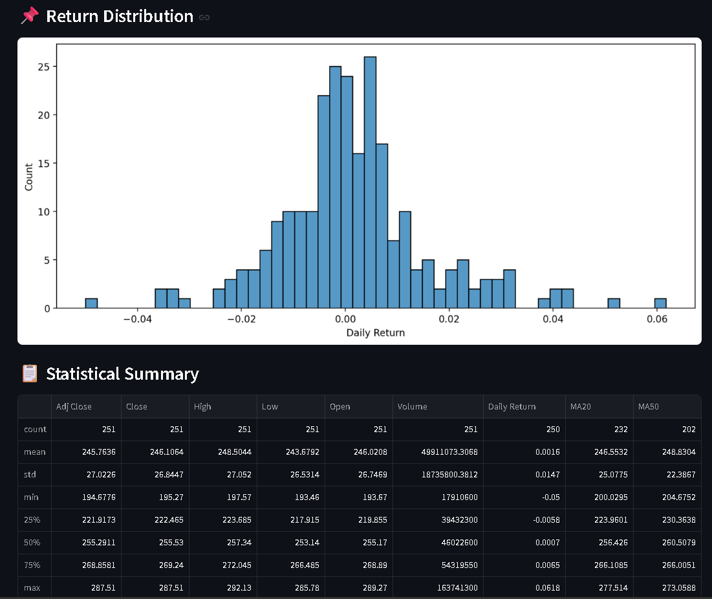
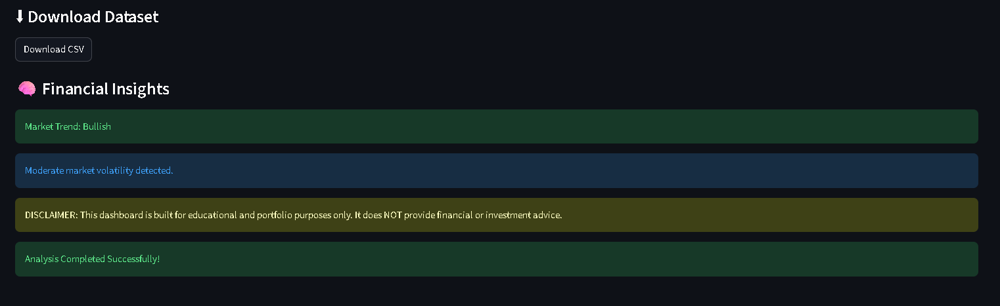
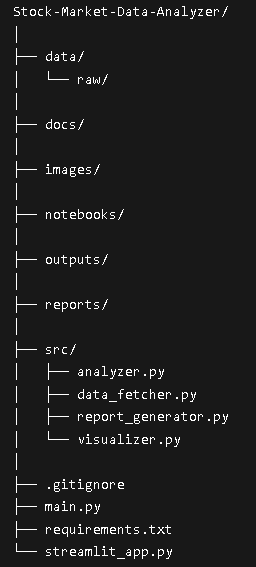

# 📈 Stock Market Data Analyzer

<div align="center">


# 🚀 Industry-Level Financial Analytics Dashboard

An interactive stock market analytics platform built using **Python, Streamlit, Plotly, Pandas, and Yahoo Finance API**.

🔗 **Live Demo**  
https://stock-market-data-analyzer-ag2urk2uzzf9tjvyusduvt.streamlit.app/

🔗 **GitHub Repository**  
https://github.com/Vayu-143/Stock-Market-Data-Analyzer

---

## 👨‍💻 Developer

# **Vayunandan Mishra**

</div>

---

# 📌 Project Overview

The **Stock Market Data Analyzer** is a professional financial analytics dashboard that allows users to:

- Analyze historical stock market trends
- Visualize stock price movement
- Calculate moving averages
- Analyze daily returns
- Measure stock volatility
- Generate financial insights
- Download stock datasets
- View interactive charts and analytics

This project demonstrates real-world skills in:

- Python Development
- Financial Analytics
- Data Visualization
- API Integration
- Dashboard Development
- Streamlit Deployment

---

# ✨ Features

## 📊 Financial Analytics
- Real-time stock data analysis
- Historical stock price tracking
- Daily return calculation
- Volatility analysis
- Moving average analysis

---

## 📈 Interactive Visualizations
- Interactive Plotly charts
- Moving average graphs
- Return distribution histograms
- Statistical dashboards
- Responsive UI

---

## 📁 Dataset Handling
- CSV export functionality
- Historical dataset preview
- Automated stock data fetching
- Data cleaning pipeline

---

## 🎯 Professional Dashboard
- Industry-level UI
- Sidebar controls
- Interactive charts
- Full-width responsive layout
- Financial insight generation

---

# 🛠️ Tech Stack

| Technology | Purpose |
|---|---|
| Python | Core Programming |
| Streamlit | Dashboard Development |
| Plotly | Interactive Charts |
| Pandas | Data Analysis |
| NumPy | Numerical Computation |
| Matplotlib | Visualization |
| Seaborn | Statistical Graphs |
| yFinance | Stock Market API |

---

# 📂 Project Structure

```text
Stock-Market-Data-Analyzer/
│
├── data/
│   └── raw/
│       └── AAPL_stock_data.csv
│
├── docs/
│
├── images/
│   ├── AAPL_closing_price.png
│   ├── AAPL_moving_average.png
│   ├── AAPL_return_distribution.png
│   ├── dashboard_top.png
│   ├── moving_average_daily_return.png
│   ├── return_distribution_statistics.png
│   ├── financial_insights.png
│   └── project_structure.png
│
├── notebooks/
│
├── outputs/
│
├── reports/
│
├── src/
│   ├── analyzer.py
│   ├── data_fetcher.py
│   ├── report_generator.py
│   └── visualizer.py
│
├── .gitignore
├── main.py
├── requirements.txt
├── README.md
└── streamlit_app.py
```

---

# ⚙️ Installation

## 1️⃣ Clone Repository

```bash
git clone https://github.com/Vayu-143/Stock-Market-Data-Analyzer.git
```

---

## 2️⃣ Navigate to Project Folder

```bash
cd Stock-Market-Data-Analyzer
```

---

## 3️⃣ Install Dependencies

```bash
pip install -r requirements.txt
```

---

# ▶️ Run Project

## Run Main Python Project

```bash
python main.py
```

---

## Run Streamlit Dashboard

```bash
streamlit run streamlit_app.py
```

---

# 🌐 Live Application

## 🚀 Open Live Dashboard

https://stock-market-data-analyzer-ag2urk2uzzf9tjvyusduvt.streamlit.app/

---

# 📸 Dashboard Screenshots

## 📊 Dashboard Overview



---

## 📈 Moving Average + Daily Return Analysis



---

## 📉 Return Distribution + Statistical Summary



---

## 🧠 Financial Insights



---

## 💻 VS Code Project Structure



---

# 📊 Dashboard Capabilities

✅ Real-time stock analytics  
✅ Interactive financial charts  
✅ Daily return analysis  
✅ Volatility measurement  
✅ Moving averages  
✅ Statistical summaries  
✅ Downloadable CSV reports  
✅ Professional financial dashboard  

---

# 🧠 Key Learnings

This project helped in understanding:

- Financial market analytics
- Streamlit dashboard development
- Interactive visualization techniques
- API-based data fetching
- Data preprocessing
- Statistical analysis
- GitHub project deployment

---

# 🚀 Future Improvements

- Multi-stock comparison
- Candlestick charts
- RSI & MACD indicators
- Portfolio analysis
- Machine learning stock prediction
- Real-time streaming data
- Cloud database integration

---

# 📌 Resume Description

> Developed an industry-level Stock Market Analytics Dashboard using Python, Streamlit, Plotly, and Yahoo Finance API. Implemented moving averages, daily return analysis, volatility analysis, interactive financial visualizations, and downloadable reports.

---

# ⚠️ Disclaimer

This project is built for **educational and portfolio purposes only**.

It does **NOT** provide financial or investment advice.

---

# ⭐ Support

If you found this project useful:

⭐ Star the repository  
🍴 Fork the project  
📢 Share with others

---

<div align="center">

# 🚀 Built with Python & Streamlit

## By Vayunandan Mishra

</div>